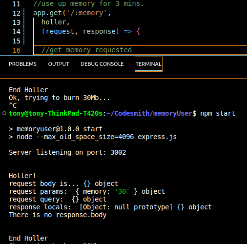

# Holler

This is meant to replace console logs in express routes and middleware. 
You can place this in your express routes, then comment them out when you don't need them any more. 
This saves you the time and effort of taking your console logs out of your code when you're done. 

Holler lists:
- request.body
- request.params
- request.query
- response.locals
- response.body

Holler does not change your data in any way. It should not slow down your Express app in any significant way. It's just console logs. 

## An example


Now you can trace request.body, etc, as it moves through all your middleware, without clogging up your modules with console logs. 

Holler is written in Javascript and uses CommonJS import/export for easy use in Node.js. 

## Install
Install from npm with 
```npm install @tonydiethelm/holler```
Load into your CJS node app  with 
```const holler = require('@tonydiethelm/holler')```

## Written by Tony Diethelm | [github](https://github.com/tonydiethelm) | [linked](https://www.linkedin.com/in/tonydiethelm)
